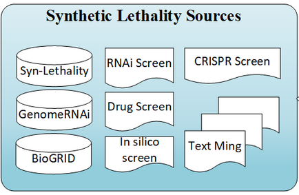
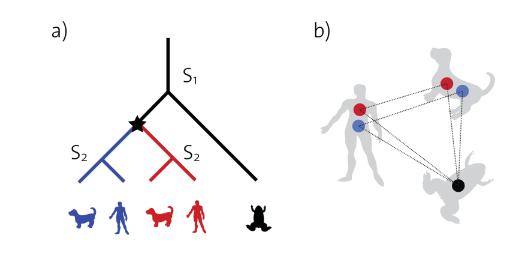
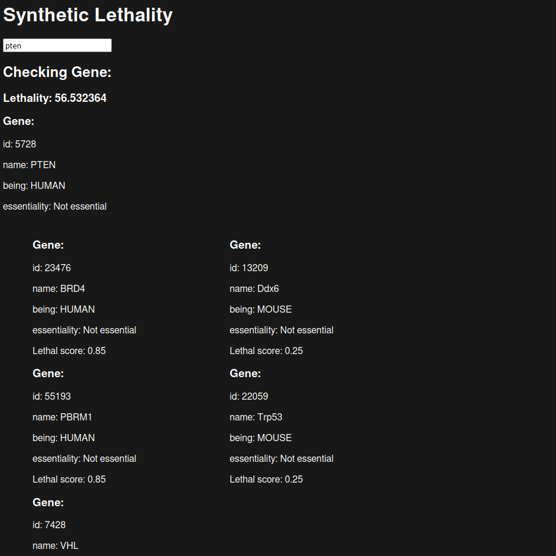

= DBI cancer research
:toc: left
:sectnums:
:toclevels: 3
:table-caption:
:linkattrs:
:experimental:
Aichinger Tobias, Breinesberger Markus, Ilming Winnnie and Nikolaus Alexander

== Background

This project is giving specialists the ability to quickly get a lethality score of a gene and producing a list of all it's synthetic lethal pairs. It also uses two other beings for better results because human genes are not tested very well.

== Team members

* Ilming Winnie (parser)
* Tobias Aichinger (transform, visualize)
* Nikolaus Alexander (Documentation)
* Breinesberger Markus (Documentation)

== Entity Relationship Model

We have a rather simple data model, but it works for our use case. It uses a SynLeth table to store the synthetic relation of two genes and also has a gene table where it stores all the genes we have with the being.

image::https://www.plantuml.com/plantuml/png/RP31oeCm48Jl-nJx0Zdy_x4dAPHIQ4y-GJ2Z1dGZoVOWwhktiLeGUXicyys4BPBQgC--emwriWQElccLdO-er0SXkeXw7VaA0K_4x1tUJkqHYTaOOXRR8sj6IldDTcKL8cZPsNAKExHTyGQ2c_lxgl-z9HsPCxmqs-1XQ25Q_xBCnipp9qVRmcxcm2zl8uCnOU9Ld_XXXo5N512N3_42[]

== Data

=== SynLethDB

The SynLethDB is used for getting the synthetic lethal pairs for the different beings (Human, Mouse and Yeast). We only used teh SynLethDB because it uses data from BioGrid. See:

=== Orthology databases

OMA is used to map the genes of different beings together.

=== Gene essentiality

For gene essentiality OGEE (Online GEne Essential database v3.09) is used. There are two different types of essential genes

* CSEGs	Cancer-specific essential genes
* CEGs	Core-essential genes

Criteria used for classifying CSEGs and CEGs: CSEGs - Genes tested in more than 10 cell lines and essential in only one particular cancer.
CEGs - Genes essential in 80% or more tested cell lines.

== Architecture

image::https://www.plantuml.com/plantuml/png/HK_Doi8m4BplKoozzmK-FgI2nOjIGV4YFQpjsXRJL3SRHCLtDpIqvZ8_4sROp2c9-jx0ZQehDOmhKi8tO7Yd_TDkMDiogcAxdDWwpqlu0DYXPjoHE9R83qBMNGRfepnspfFfNWmrAPt9CIQ5K6Ku0HYNqdGn5KGOdVW78k1_QeBtgvvPI48mZ-0VDgmeVFVi51-Tji6mZ9Pw1iZOrk7IBm00[]

In the architecture above you can see that we have three layers in our project. Starting with the parser, continuing with the transformer and the last thing is the visualizer.

=== Parser

Here we use a go program which reads all the files and brings the data the form of our erd which then gets inserted into the database.

=== Transform

Transform is a axum a web application framework which has a single get request taking a gene identifier (name) as a path parameter and returns the transformed data (=> meaning we get the gene from the identifier from the database, and then we use that gene to map it to the other beings we have. After that we check if one of the genes is synthetic lethal and for the case of other beings we check that the gene is also contained in the human)

=== Visualize

Visualize is our frontend where you have a user interface for entering a gene identifier after that we get the gene from the database (or a gene not found we don't know it), then we show three rows in the first row there are the lethal pairs for human genes in the second the lethal pairs for mouse genes and in the third row are the lethal pairs for the yeast genes and also a score we calculated

==== Score calculation

The score is not in percent or something it is just a rough number we calculate using the sum of the lethal pairs where we multiply the lethality score with the gene essentiality score which filters out the pairs where the gene is not essential.

Here is the code for the score calculation:

[source, rs]
--
let mut score = genes.request_gene.essentiality_score.unwrap_or_default();

let pred = |g: &Lethal| -> f32 {
    g.lethality_score * g.gene.essentiality_score.unwrap_or_default()
};

let lethality_score =
    genes.yeast_genes.iter().map(pred).sum::<f32>()
    + genes.human_genes.iter().map(pred).sum::<f32>()
    + genes.mouse_genes.iter().map(pred).sum::<f32>();

score += (1. - score) * lethality_score;
--

What it looks like:

== How to run the project

This setup was tested on arch linux (for ubuntu or other linux distributions it should also work)

* Dependencies
** go (version. go1.20.11)
** rust (version. cargo 1.73.0)
** oracle-instant-client
** docker
