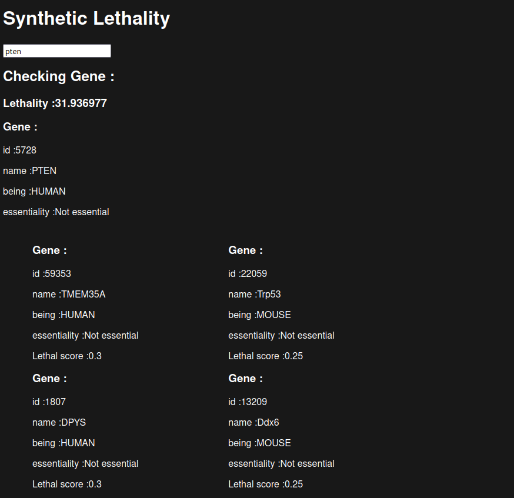

= documentation-cancer-research

image::img/cld.png[]

== Data used:

We used Genes from

- Human
- Mouse
- Yeast

We use OMA to map the Types for different species,

and Syn-let to get the (BioGrid data) synthetic lethal genes

[source]
--
OGEE: Online GEne Essential database v3.09

Short forms used:
CSEGs	Cancer-specific essential genes
CEGs	Core-essential genes

Criteria used for classifying CSEGs and CEGs:
CSEGs - Genes tested in more than 10 cell lines and essential in only one particular cancer.
CEGs - Genes essential in 80% or more tested cell lines.
--

== Parse Data:

We prepare our Data with GO

[source]
--
parsing/setup-db/main.go
--

[source,go]
--
const (
	HUMAN = 1
	MOUSE = 2
	YEAST = 3
)

type gene struct {
	id             int
	name           string
	essentialScore *float32
	being          int
}

type dependency struct {
	gene1 gene
	gene2 gene
	score float32
}

type mapping struct {
	gene1 gene
	gene2 gene
}
--

== Transform/API

Rest interface:

Get requests give us the Genes

Our goal is to find genes equivalent to the human gene and to check whether the animals' synthetic lethal gene has a human gene. if that is the case, we will return it

== Visualize

=== Scoring
[source,rs]
--
let mut score = genes.request_gene.essentiality_score.unwrap_or_default();

                        let pred = |g: &Lethal| -> f32 {
                            g.lethality_score * g.gene.essentiality_score.unwrap_or_default()
                        };

                        let lethality_score =
                            genes.yeast_genes.iter().map(pred).sum::<f32>()
                            + genes.human_genes.iter().map(pred).sum::<f32>()
                            + genes.mouse_genes.iter().map(pred).sum::<f32>();

                        score += (1. - score) * lethality_score;
--

An example for the use of our Website:

